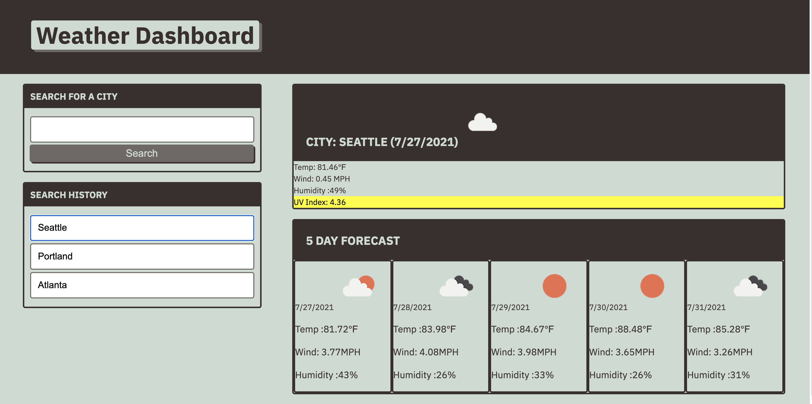

# Taylor anderson
# Homework #6 Server-Side APIs: Weather Dashboard
# Technologies used: HTML, CSS, JS, OpenWeather API

## Task

Build a weather dashboard that will run in the browser and feature dynamically updated HTML and CSS.

Use the [OpenWeather One Call API](https://openweathermap.org/api/one-call-api) to retrieve weather data for cities. Use `localStorage` to store any persistent data.

## Acceptance Criteria

```
GIVEN a weather dashboard with form inputs
WHEN I search for a city
THEN I am presented with current and future conditions for that city and that city is added to the search history - [X]
WHEN I view current weather conditions for that city
THEN I am presented with the city name, the date, an icon representation of weather conditions, the temperature, the humidity, the wind speed, and the UV index - [X]
WHEN I view the UV index
THEN I am presented with a color that indicates whether the conditions are favorable, moderate, or severe - [X]
WHEN I view future weather conditions for that city
THEN I am presented with a 5-day forecast that displays the date, an icon representation of weather conditions, the temperature, the wind speed, and the humidity - [X]
WHEN I click on a city in the search history
THEN I am again presented with current and future conditions for that city - [X]
```

## Screenshot



## Link to deployed application

https://newengood.github.io/homework-06-weather-dashboard/

- - -
MIT License

Copyright (c) 2021 Newengood
